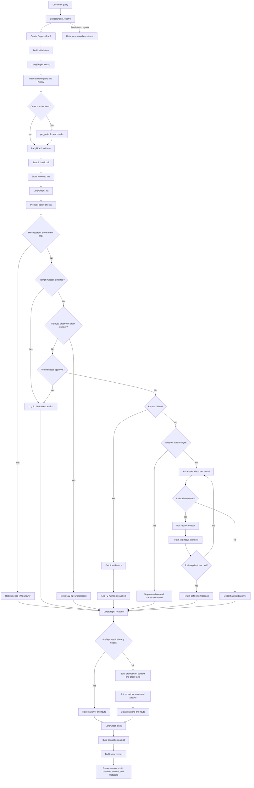

# Support Agent Execution Flow

This diagram shows how one customer question moves through the current program.

## Whole Execution Flow



## What Each Main Step Means

### 1. `SupportAgent.resolve`

This is the public entry point used by the evaluator, batch runner, and web app. It creates a graph and starts one customer request.

### 2. `lookup`

The lookup node searches the current question and previous conversation history for order IDs such as `MRD-700121`. If it finds one, it calls `get_order()` and stores the order facts in the graph messages.

### 3. `retrieve`

The retrieval node searches the handbook and stores the matching sections. These sections are later placed inside an untrusted-data block before being sent to the model.

### 4. `act`

The act node has two paths:

- **Deterministic preflight path:** Python handles missing information, injections, delayed-order credits, unsafe refunds, safety incidents, and repeat failures.
- **Model tool-loop path:** the model requests a tool, Python runs it, the result goes back to the model, and the loop repeats until the model stops requesting tools or reaches the step limit.

The important safety idea is that the model can suggest a tool, but Python policy code controls whether risky actions are allowed.

### 5. `respond`

If the act node already produced a deterministic answer, the response node reuses it. This prevents actions from being run twice.

Otherwise, the response node sends the retrieved context, order facts, conversation history, and customer question to the model. The model returns:

```json
{
  "answer": "...",
  "citations": ["returns"],
  "route": "resolved"
}
```

The program then removes invalid citation names and keeps only allowed routes.

### 6. Trace creation

The final trace records:

- the answer
- the route: `resolved`, `needs_info`, or `escalated`
- citations
- executed and blocked actions
- escalation information
- timing and model metadata

The evaluator scores this trace.

## Simple Version

```text
Question
  |
  v
Find order facts
  |
  v
Search handbook
  |
  v
Run Python safety checks
  |
  +--> Need information? Ask customer
  |
  +--> Unsafe or approval needed? Escalate
  |
  +--> Delayed order? Give allowed 500 INR credit
  |
  +--> Safe request? Let model use tools in a bounded loop
  |
  v
Generate or reuse final answer
  |
  v
Clean citations
  |
  v
Create trace and return result
```

## Important Current Limitation

The current graph still has fixed LangGraph edges:

```text
lookup -> retrieve -> act -> respond -> end
```

The branches shown inside `act` are Python decisions inside the node. Full LangGraph conditional edges, checkpoint memory, human interrupts, and `SupportAgent.resume()` are still future work for TODO 6.
